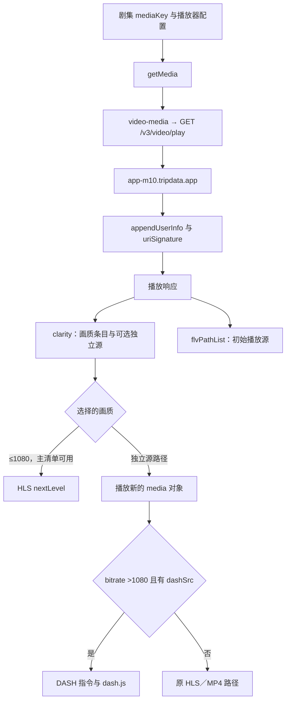

# YFSP 网页播放功能与接口说明

更新日期：2026-09-26。当前脚本版本：1.9.7。本文说明网页增强脚本的播放接口、清晰度切换、广告处理和兼容机制。客户端代码分析以 Windows 3.1.5 为参考；接口返回可能随版本、内容和会话变化。

**当前结果：576↔720 网页往返切换与实际播放已经验证；1080P、2K／4K 的客户端分流逻辑已还原，当前会话尚未拿到高档位源，不能宣称这些档位已播放成功。**

本文集中说明功能原理、接口参数、已验证结果和诊断方法。安装与日常使用请参阅 [README](README.md)，脚本文件为 `yfsp-unlocker.js`。

> 1.9.4 恢复组件层游客兼容，并增加独立的中插广告调度拦截，详见第 16 节。文中的 1.9.3 对照结果属于该版本的验证记录，不代表后续版本已完成所有现场验收。

播放能力分为两件独立的事：**先取得对应清晰度的真实地址，再验证网页播放这些地址。** 高档位支持首先需要确认地址；不能用播放器尚未接入 DASH 解释接口没有返回地址。离线下载和独立播放器已排除；UA 保持不变。

| 证据类型 | 如何解读 |
| --- | --- |
| 使用反馈 | 有同账号同集客户端免费播放 720P、1080P 的反馈；不据此推断所有内容和会话的可用性 |
| 静态代码 | 确认请求构造、条件分支和回调，不等同于服务端实际响应 |
| 原函数／脚本测试 | 确认指定输入下的行为，不把测试夹具当作平台收费规则 |
| 网页现场接口与解码 | 已证实免费 720、576↔720 切换；只代表记录的会话与样本 |
| 尚未验证 | 原生客户端成功切到 1080／4K 时的完整运行状态、实际高档源及购买后响应 |

阅读导航：第 1～5 节为取源与播放链路；第 6～7 节为缺失证据和复核入口；第 8 节为低档地址差异；第 9 节为金币接口；第 10～12 节为客户端机制、历史更正、实播和当前实现；第 13～15 节为测试、诊断代码及复核步骤；第 16 节为兼容回归修复。

## 1. 取源请求链路



客户端 `getMedia` 构造一次 `video-media` 请求，URL 配置映射到 `video/play`。`APIV3_ENDPOINT` 使用 `app-m10.{Host}`；`GetHost` 在客户端构建中从 `injectJson.defaultHost` 取主机，客户端默认配置为 `tripdata.app`。这与网页的 `m10.yfsp.tv` 不同，已是免费 720P 差异的实证原因。

| 参数 | 客户端来源与含义 | 本次确认 |
| --- | --- | --- |
| `id` | 当前剧集媒体标识 | 与每档 `clarity.key` 可能不同；不能假设互换就能取得高档源 |
| `cinema` | 接口默认参数 | 当前构建为 1 |
| `lang`、`region` | 播放配置；地区缺省 `GL.` | 网页实际请求 `GL.`；不把它等同于真实出口地区 |
| `device` | `getMedia` 写入常量 | 1，网页请求也已有此值 |
| `a` | 自动播放布尔值 | 0 或 1 |
| `isMasterSupport` | `canUseMaster` 能力标记 | 默认 1；实测设为 0 会去掉自动主清单条目，但未得到高档源 |
| `sharpness` | 已保存的偏好 | 720、1080 等菜单单位；不是响应里的 720000、1080000 |
| `line` | 已保存线路 | 当前条目仅见 0，没有发现可据此填写其他线路值的证据 |
| `usersign` | `getMedia` 设置为 1 | 后续会话／签名帮助类仍会参与请求处理 |

接口响应的 `clarity.bitrate` 由页面除以 1000 后交给播放器，例如 1080000 → 1080。不能把响应单位直接填进 `sharpness`。后续帮助类增加会话参数和签名；本报告及附录中的诊断代码不导出这些值。

## 2. 各档位实际如何切换

| 项目 | 1080P | 2K／4K（代码判断为 >1080） |
| --- | --- | --- |
| 当前响应是否一定有该档 | 否，须检查返回条目和实际主清单 | 否；当前剧集没有单列 2K，只有 4K 条目 |
| 选择时保存 `sharpness` | 是 | 客户端此分支不保存 |
| 是否走 HLS 主清单 | 主清单可用且播放器无错误时会走 | 客户端明确走独立源分支 |
| 是否要求 `path` | 主清单切档无需独立 `path` | 需要对应独立源描述 |
| 传给播放器的关键字段 | `qualityIndex`，或独立 HLS 源 | `src`、`dashSrc`、`bitrate`，保留播放时间 |
| 播放源选择 | 原 `src` | 有 `dashSrc` 时优先 DASH，否则 `src` |

已提取客户端原方法执行验证：1080 在主清单模式调用 `changeBitrate`；1440／2160 即使已启用主清单，也调用 `playVideo` 并写入 `dashSrc`、`bitrate`。`videoSrc` 对这两个高档位优先选 `.mpd`。

在已检查的 `selectBitrate → onSelectBitrate` 链路内，没有发现点击高档位后自动请求一个新的“4K 解析 API”的步骤：选择器发送条目，播放器消费条目已有的 `path` 或已有清单。页面 `reloadClairty` 仍调用同一个 `getMedia`。这不证明整个客户端没有其他动态行为，但不能凭空添加所谓专用解析接口。

## 3. DASH 与网页的实际差异

客户端模板同时绑定 `vgDash`、`vgHls`，源来自 `videoSrc(media)`。DASH 指令识别 `.mpd` 或 `mpd-time-csf`，通过 `dashjs.MediaPlayer().create()` 接入，使用预存播放位置；指令中也有可选 DRM 配置支持，但不意味着本次源使用 DRM。

当前网页真实 `<video>` 的 Angular 上下文只有 HLS 指令，未挂载 DASH 指令；播放器组件也没有客户端的 `videoSrc` 方法。**这说明浏览器当前页面缺少这段接入，不意味着浏览器技术上不能播放 DASH。** 只给对象增加 `dashSrc` 或只去掉客户端下载提示都不够。若将来拿到实际高档源，应分别验证独立 HLS 和 DASH 生命周期，包括旧实例销毁、时间恢复、清晰度状态和错误回退。

此外，`dashResult` 字段非空并不保证它是 MPD：本次 720 条目的该字段实际指向 `/v3/video/masterplaylist/...`；576 条目才有真实 `.mpd`。应按真实响应内容判断格式。

## 4. 本次接口对照结果

所有请求均为读取接口或读取服务端已返回的媒体清单；没有提交购买操作，没有改写会员字段、伪造源 URL 或更改 CDN 路径。

| 对照 | 结果 | 可得结论 |
| --- | --- | --- |
| 网页主机 → 客户端主机 | 720 从无源变为正常可用；已实播 1280×720 | 客户端主机适配有效 |
| 客户端接口，未登录与当前会话 | 均返回免费 720 | 免费 720 不依赖伪造身份 |
| `sharpness=1080` | 仍返回 720 初始源，1080 条目无源 | 偏好参数不能单独保证返回 1080 |
| 用返回的 1080 `clarity.key` 请求 | HTTP 200、业务 code 0，初始源仍为 720；1080 无独立源 | 不是简单换 `id` 即可解决 |
| 用返回的 2160 `clarity.key` 请求 | 同上，2160 无独立源 | 同样不能靠媒体标识替换保证 4K |
| `isMasterSupport=0` | 576、720 有独立源，1080、2160 仍无源 | 差异不只是主清单响应隐藏了独立地址 |
| 实际 HLS 主清单 | 仅 576、720 两层 | 当前不能按索引切到不存在的 1080／2160 层 |
| 服务端提供的 576 DASH 清单 | HTTP 200、`application/dash+xml`；一条 864×486 AVC 视频轨和一条 AAC 音轨，无 `ContentProtection` | 此 MPD 没有包含更高分辨率的视频轨 |

按媒体标识对照的首轮调试调用超时；随后使用有 12 秒请求上限、保存结构化结果的读取探测完成了验证。超时不计作服务端拒绝或无源证据。

## 5. 配置差异与验证边界

参考客户端使用的默认主机为 `tripdata.app`。启动时 `Object.assign({}, storedInjectJSON, selectedApplication.injectJSON)` 中内置配置靠后，因此不能直接假定远端同名设置覆盖内置主机。

同账号不等于相同的请求环境。高档位对照需要同时确认请求配置、源描述、HLS／DASH 层级和解码尺寸。地区、出口或后续状态是否影响结果尚未验证；一次网页无源响应不能否定其他客户端场景的免费播放反馈。

## 6. 下一步所需的最小客户端证据

第 14 节提供只读诊断代码：在客户端实际选中 1080P 或 4K 后，在该页面的开发者工具控制台执行，取得 JSON 即可对照。

它只记录已加载对象：当前菜单档位、`videoWidth/videoHeight`、清单层级、是否挂载 DASH、媒体格式类别、最近播放请求的主机和白名单业务参数。不发请求、不改播放、不读存储，不导出账号 ID、Cookie、Token、签名、设备 UUID 或完整媒体地址。诊断代码已在网页及隔离测试中验证，尚未完成原生客户端运行验证。

参考客户端支持通过 `--inspect` 打开 DevTools。诊断结果用于区分接口参数、会话环境、源选择和 DASH 接入问题。

## 7. 验证方法

- 静态调用链分析：核对请求构造、选择事件、独立源与主清单分支。
- 隔离函数实验：检查指定输入下的分支，不将模拟输入视为平台规则。
- 实际接口对照：比较业务结果、清晰度条目与真实媒体清单。
- 解码验证：检查视频尺寸、播放时间是否增长，以及往返切换后的状态。
- 隐私验证：诊断结果不包含账号凭据、签名或完整媒体链接。

测试覆盖与已运行结果见第 13、16 节，可复制诊断代码见第 14 节。

## 8. 576P 与 720P 地址逐层对照：聚焦取得 1080P 地址

本节分析如何取得高档地址。播放接入是后续独立问题，不能用 DASH 接入是否完整解释取源失败。

### 8.1 首先比较同一层级的地址

本次响应中的 576 条目直接给出 CDN 子清单，720 条目则指向 API 主清单入口。直接比较这两个字段会把不同层级混在一起：

```text
clarity[720].path.result
  https://app-m10.tripdata.app/v3/video/masterplaylist/<不透明标识>
      ↓ 主清单返回的 URI
  NAME=576 → https://sss111-e1.pipecdn.vip/<576目录>/chunklist.m3u8?<参数>
  NAME=720 → https://sss111-e1.pipecdn.vip/<720目录>/chunklist.m3u8?<参数>
      ↓ 子清单返回的 URI
  各自目录下的 media_0.ts … media_228.ts
```

`clarity[720].path.needSign=true`，客户端先用当前会话构造主清单请求；主清单返回的 CDN 子清单则有另一组地址参数。`vv/pub` 是 API 帮助类处理的参数，CDN 子清单中的 `vhash` 等值来自已返回的 URI，不能当成同一种签名直接替换。

### 8.2 两个真实 CDN 子清单的差异

| 对照项 | 实测 |
| --- | --- |
| CDN 主机 | 相同，`sss111-e1.pipecdn.vip` |
| 子清单文件名 | 都是 `chunklist.m3u8` |
| 目录长度 | 576 为 81 字符，720 为 82 字符 |
| 目录共同前缀 | 前 41 字符相同；后段分别为 40、41 字符 |
| 目录是否直接包含 576／720 字样 | 否 |
| `vendtime` | 两个子清单相同 |
| `vCustomParameter` | 相同；不记录值 |
| `vhash` | 不同；不记录值 |
| `lb` | 不同；含义未确认，不记录值 |

这些结果说明：不能从本组样本提出“替换分辨率数字即可得到 1080P”的规则；同时也没有验证 `vhash` 的具体算法或绑定范围，不能仅凭值不同就断言其算法。有效高档地址至少还缺高档目录及服务器接受的配套参数。

两个目录均有 `ppotb62-` 前缀。对后续串仅进行了离线的两种常见 Base62 字母表解码假设检查，均未得到可读 URL。该结果只否定这两种朴素解码假设，不证明它是加密串，也不证明不存在其他编码规则。没有据此生成猜测地址发送给 CDN。

### 8.3 两个子清单的内容对照

两份真实子清单均 HTTP 200，内容以 `#EXTM3U` 开头：

| 项目 | 576P 子清单 | 720P 子清单 |
| --- | --- | --- |
| 分片数 | 229 | 229 |
| `EXTINF` 时长总和 | 2821.163 秒 | 2821.163 秒 |
| 首尾文件名 | `media_0.ts` ～ `media_228.ts` | 相同 |
| 完整点播结束标记 | `EXT-X-ENDLIST` | 相同 |
| 分片 URI 的参数名 | `vCustomParameter/lb/ab/verify` | 相同 |

因此这些分片编号是按时间排列的编号，不是画质编号。两档使用相同数量的时间分片，但各自指向不同目录。本次未下载整集分片，也没有将 `media_0.ts` 改名猜作高档媒体。

### 8.4 用 1080P 媒体标识进一步核对返回地址

对照使用播放接口实际返回的 1080P 条目 `key`。它是媒体标识，**不是可播放 URL**。

以该标识请求已确认的客户端播放接口，并明确采用主清单模式后：

- HTTP 200，业务 `code=0`。
- 对应 1080 条目中的 key 与请求标识相同，但 `path` 仍为空。
- `playingMedia.title` 为 720。
- 返回的 720 主清单入口与页面当前已有的入口字符串完全一致。
- `flvPathList` 中没有其他大于 720 的真实源。

也就是说，本次请求并未取得新的 1080 主清单入口；不是“已拿到高档地址但播放器不会播放”。同时不能由这一次结果推出客户端免费 1080 场景不存在。

### 8.5 地址生成线索与当前边界

在已分析的客户端 JavaScript／HTML 中搜索 `masterplaylist`、`chunklist.m3u8`、`vendtime`、`vhash`、`pipecdn` 和 `media_0.ts`，未找到这些 CDN 路径或参数的构造实现。已检查的客户端方法消费服务端返回的 `path.result/dashResult`，其 API 签名帮助类也没有给出 CDN 目录映射规则。

**现有证据支持继续追查播放接口／主清单服务返回高档目录的条件，不支持声称已从两条低档地址计算出 1080P 地址。** 尚不能确定具体生成算法位于何处，服务器实现并不包含在本次可读代码中。下一份具有区分力的证据是客户端取得高档位时的取源响应或清单 URI，而不是增加播放器功能。

## 9. “40 金币”弹窗的事件链

本轮只读核查客户端原代码与网页当前组件状态，没有点击“立刻解锁”，没有执行购买接口。

### 金额来源

视频数据转换器直接保留响应字段 `unlockGold`，视频页再执行 `this.unlockGold=this.video.unlockGold`，通过播放器传入清晰度选择器的 `gold`。

当前网页运行时确认：`video.unlockGold=40`、页面 `unlockGold=40`、播放器 `unlockGold=40`、选择器 `gold=40`。因此 40 来自视频数据和组件传参，不是选择器按 720／1080／4K 计算的金额，也不是脚本写死的金额。构造器中的缺省值是 100，已被当前视频值覆盖。

### 何时弹出

客户端 `selectBitrate` 先跳过重复选择同一 key 的操作，然后检查：

```text
条目 isVIP 且未登录 → 登录提示
条目 isVIP 且未购买 且当前用户 roleId===0
    → setState({price: gold, mediaId: 条目.key})
    → 打开 purchase-required
    → return
否则 → 发出 onBitrateChange，进入正常切源
```

该购买提示分支不检查 `path`，也不以字面上的“720P”或“1080P”为条件；40 不参与是否有源的判断。当前会话 `roleId=0`，客户端接口返回的 720 条目 `isVIP=false`，因此免费 720 不进入此分支。之前网页接口对同一档返回了不同标记，才会触发相同的提示。

选择函数进入弹窗分支后提前返回，尚未发出画质切换事件。该函数在此分支没有调用 `getMedia` 或购买服务；`setState` 是向本地状态流发送对象。故“弹出 40 金币”本身不是“新一次高档取源请求失败”的证据，更不是已发生扣币的证据。

### 确认操作之后的代码路径

客户端视频页的 `buyMedia()` 先比较余额与状态中的价格，随后才调用 `_videoService.purchaseMedia(user, mediaId)`。服务层将其映射到 `video/payvideobygold`。虽然封装使用 GET，但它是购买动作，不能当成无副作用的取源探测接口。

代码的成功分支处理 `issucess`、媒体 key、金币余额等返回数据，然后调用 `reloadClairty()`；后者重新调用同一个 `getMedia`，即 `/v3/video/play`，刷新清晰度、购买状态和相关播放数据。

```text
点击画质 → 本地判断 → 显示金额提示（尚未切源）
明确确认 → 购买服务 → 成功回调 → reloadClairty
                                  → 再请求 /v3/video/play
                                  → 接收更新的 clarity/path
```

这为取源分析提供的线索是：客户端期望通过刷新正常播放接口获得更新后的源描述，并没有在弹窗里根据 40 金币直接计算 CDN 地址。具体购买覆盖哪几档、以及用户免费 1080 场景使用何种返回状态，不能由相同金额或这段成功回调推断；本轮没有实测购买后的响应，也不据此认定 1080 必须付费。

### 9.1 点击购买后的接口与参数明细

以下来自 Windows 3.1.5 客户端静态调用链，不是一次实际扣币抓包。主机按已核实的默认配置 `app-m10.tripdata.app` 展开；登录参数仅列名称，不记录值。

1. `buyMedia()` 比较 `user.dnCoins` 与 `videoInShoppingCart.price`。不足时打开 `media-unavailable`，传本地 UI 参数 `media-unavailable-price`，随后返回，不发购买请求。
2. 余额检查通过且 `videoInShoppingCart.mediaId` 非空时，置 `purchasing=true`，执行 `purchaseMedia(user, mediaId)`。
3. `purchaseMedia` 仅向 URL 构造器传 `{id: mediaId}`；接口配置补 `cinema=1`。HTTP 帮助类追加当前登录会话字段，再追加 `vv/pub`，发送带 `withCredentials=true` 的 GET。

| 阶段 | 请求 | 参数与来源 |
| --- | --- | --- |
| 购买 | `GET https://app-m10.tripdata.app/v3/video/payvideobygold` | `cinema=1`；`id=videoInShoppingCart.mediaId`，清晰度弹窗场景来源于点击条目的 `key` |
| 购买成功后刷新 | `GET https://app-m10.tripdata.app/v3/video/play` | `cinema=1`；`id=this.newMediaKey`；`a=0`；`usersign=1`；`device=1`；`region` 为配置值或 `GL.`；`lang`、`sharpness`、`line` 为当前配置；`isMasterSupport` 根据 `canUseMaster` 为 1 或 0 |
| 两者的公共会话参数 | 同一 HTTP 帮助类自动追加 | 会话 token 对象的字段（包括 `uid/expire/gid/sign/token`），以及请求签名 `vv/pub`；实际字段集合以当前 token 对象为准 |

可选配置值为空或 undefined 时，URL 构造器会省略，数字 0 保留。参数均在 URL 查询串中，这两次调用没有 POST body。购买接口虽然用 GET，语义仍是会改变账户状态的购买动作。

**购买请求没有 `price=40`、`gold=40`、分辨率或客户端指定的扣款金额字段。** `price` 用于本地展示及余额检查；发送给购买接口的业务输入是媒体标识。服务端实际如何计价、扣多少，需要真实响应或交易记录确认，不能由前端变量推出。

`reloadClairty()` 的 `id` 是此前正常播放响应保存的 `mediaKey`（`normalRenderPlayer()` 中 `this.newMediaKey=t.mediaKey`），不是直接把购买请求的媒体 id 或成功响应的 key 原样传过去。二者必须分开记录。

### 9.2 成功与失败如何处理

HTTP 帮助类先检查响应 `data.code`，正常时取 `data.info`；购买服务再取 `[0]`。视频页消费该对象的字段如下：

| 字段 | 客户端用途 |
| --- | --- |
| `issucess` | 按客户端原拼写判断业务成功 |
| `key` | 用逗号切分，取第一项设置成功弹窗媒体标识、匹配并标记本地播放列表 `bought=true` |
| `json.gold` | 更新本地 `user.dnCoins`；代码没有把它当作本次扣款额 |
| `json.currentLevel` | 更新本地用户等级 |
| `subtitle` | 放入成功弹窗的附加文字区域，具体内容由返回值决定 |

成功时显示“视频已解锁，并已添加到收藏夹”的文案，然后执行上述 `/v3/video/play` 刷新。所检查的 `buyMedia()` 成功回调没有另行调用收藏接口；文案本身不能替代对服务端收藏动作的验证。

`issucess` 为假时显示 `message-dialog`，不走成功后的刷新。更外层 `data.code` 非正常值由公共错误处理分支处理（例如登录失效提示）；不能把 HTTP 200 一概视为购买成功。

刷新响应继续交给 `invokeClarity/checkIsBought/reloadPause` 等方法；是否真正返回更高清的 `path`，仍须查看该次响应，不能从购买弹窗的文案直接推断。

上述购买链路来自静态代码分析，尚未实测购买后的响应。

## 10. 客户端身份与缓冲能力

### 10.1 客户端参考范围

相关逻辑以 Windows 客户端 3.1.5 为参考。该客户端采用 Electron；网页与客户端在 API 主机、模块构建配置和播放器能力上存在差异。脚本适配范围与实际播放结果应分别判断，不能仅凭客户端版本号推断某档画质一定可用。

### 10.2 `extra_data`、构建配置和 UA

Electron 的 `injectUUID` IPC 经 `scripts/main.js` 将 UUID、首次生成时间 `start`、`isApp:1`、Windows 包名 `com.iiff.www`、`appVersion:3.1.5`、`system:WINDOWS`、空 `deviceInfo` 写入 `window.extra_data`。

已检查客户端 main 中该对象的三个字面引用位于广告／内容 `record` 表单构造处，尚未证明它控制影视播放响应。模块内部另有 `app:true` 构建配置；向页面注入 `extra_data.isApp` 不会把模块配置或 API 主机自动改成客户端值。

候选脚本保留实验性标识注入：在油猴存储生成并持久化独立随机 UUID，不读取原生客户端设备身份；保留对象中无关字段；失败时不阻断播放初始化；开关下次刷新生效。**UA 没有修改，免费 720 的已证实修复来自播放 API 主机适配。**

### 10.3 云加速与点播缓冲不能混称

客户端的会员说明把云加速描述为服务端 VIP 加速主机。本次没有找到可直接移植的独立云加速引擎，也没有实测官方线路调度或卡顿率改善。

网页 Angular 上下文中已确认 HLS 实例与当前视频对应。初始点播配置观察值为 `maxBufferLength=30`、`maxMaxBufferLength=600`、`maxBufferSize=60000000`。

候选脚本对确认的点播提高目标至至少 90 秒／128 MiB；设备内存报告小于 4 GiB 时采用 45 秒／64 MiB。直播、未知清单、省流量模式不调整；保留其他脚本已设置的更大值，关闭时仅恢复仍由本脚本控制的配置。它增加缓冲余量，不创造带宽或新的 CDN 线路。字节目标也不是浏览器内存硬上限，语义参考 [HLS.js 官方 API 文档](https://github.com/video-dev/hls.js/blob/master/docs/API.md)。

## 11. 历史错误、更正与原函数实验

### 11.1 已更正的判断

| 旧判断或实现 | 更正后的认识 |
| --- | --- |
| 把低档地址复制到高档条目 | 不能制造高档源；必须保持真实地址和 key，不把菜单改名当作清晰度提高 |
| 所有空 `path` 一律拒绝 | 720／1080 可走已加载 HLS 主清单，必须同时核对 levels 和独立源 |
| 只接受字符串路径 | 客户端真实路径可以是含 `result/dashResult/needSign` 的对象 |
| 根据 40 金币弹窗推断 720 收费 | 弹窗取决于该次条目与会话状态；客户端接口已实际返回免费 720 |
| 手工 VIP 测试通过就说明用户需要购买 | 测试只证明假设输入下的分支，不证明用户场景满足该假设 |
| 仅移除下载客户端提示就完成 4K 支持 | 后续还有独立源选择、DASH 与实际解码验证 |
| 只写 `isApp:1` 就等同客户端环境 | API 主机和模块构建配置仍有独立差异 |
| 以网页一次响应代表客户端能力上限 | 必须比较同账号同集；1080 用户观察不能被当前网页无源结果否定 |

版本演进：1.9 初步增加选择入口和缓冲；1.9.1 增加身份入口（当时 15 项测试）；1.9.2 修正对象路径并保留真实账户状态（19 项）；1.9.3 修正标准画质路由（22 项）、接入客户端播放 API（24 项），随后增加诊断隐私测试（共 25 项）。这些数量是历史验证记录，不能代替实播。

### 11.2 原客户端方法的九项离线实验

从已解包／保存的原 bundle 提取方法，在隔离 VM 中运行，未加载完整客户端或访问网络。

| 输入／场景 | 原函数结果 |
| --- | --- |
| 720 非 VIP、普通已登录用户、空 path | 发出选择事件 |
| 720 VIP、已购买、空 path | 发出选择事件 |
| 720 VIP、未购买、非零角色、空 path | 发出选择事件 |
| 1080 VIP、未购买、角色 0 | 打开购买确认 |
| 720 主清单模式、无错误、空 path | 调用 `changeBitrate` |
| HLS 指令合法档位索引、空 path | 设置 `nextLevel` |
| 客户端 2160、主清单启用、有对象源 | 独立源播放并保留 DASH |
| 网页同样的 2160 输入直接进入后续函数 | 仍走主清单切档 |
| 网页原始 2160 选择入口 | 打开客户端下载提示 |

另外七项原方法实验覆盖 `getMedia` 的未设置／720／1080／2160 偏好及 1080／1440／2160 播放分流。复核步骤见第 15 节。

### 11.3 主清单默认档与索引

`invokeClarity` 排除 `auto`，设置初始 `qualityIndex`，并把响应码率数值除以 1000。`onMasterPlayParsed` 按真实清单标签重新匹配索引，不能拿菜单顺序当作 HLS 层级顺序。

客户端 HLS 在 `MANIFEST_PARSED` 后优先寻找已保存 `sharpness`；无偏好时寻找名字为字符串 `720` 的档位；未找到再按用户字段选择首档或末档。严格相等比较意味着类型也需要核对。这是已有档位选择策略，不会生成缺失源。

“先点 720 再点 1080／4K”可能伴随清单解析或状态变化；目前没有原生客户端前后时序证据，不把这一操作顺序直接解释为获得其他画质权限。

## 12. 网页现场结果与当前脚本实现

### 12.1 历史基线：原网页接口实测

对照样例为《兰香如故》第 27 集，网页已登录，客户端使用相同账号与剧集。以下保留接入客户端接口前的基线，接入后的结果见第 12.2 节。样例结果不代表所有视频均有相同档位。

播放请求实际携带 `device=1`、`isMasterSupport=1`、`region=GL.`、`a=0`，未带 `sharpness` 或 `line`。HTTP 200，业务结果正常。请求已声明主清单支持，不能把差异归因于网页漏传这个开关。账号 ID、Cookie、签名、完整媒体地址不写入本报告。

| 菜单档位 | 网页响应 | 本次点击／播放结果 |
| --- | --- | --- |
| 576P | `isVIP=false`、`isEnabled=true`，有 `path.result` | 实际播放成功；解码尺寸 **864×486**，播放时间增长，读取到 694 个已解码视频帧，`readyState=4` |
| 720P | `isVIP=true`、`isBought=false`、`isEnabled=false`，`path=null` | 原站点流程显示 40 金币提示，未切换成功 |
| 1080P | `isVIP=true`、`isBought=false`、`isEnabled=false`，`path=null` | 单独点击后同样显示 40 金币提示，未切换成功 |

实际 HLS `levels.length=1`，唯一层的 `name` 为空，播放器 `isMasterEnabled=false`。`flvPathList` 的正片项只有 576 档。因此，本次网页响应并不是含 576／720／1080 三层的主清单。这个事实仅描述网页这一次响应，**不能否定用户客户端 720P 无需付费的实测，也不能证明客户端免费 720P 依靠绕过付费判断**。客户端实际响应、会话／地区与网页的差异尚未采集到；静态客户端方法不能代替这些证据。

1.9.3 通过临时页面注入验证，启用 `yfsp.playbackOnly=true` 与实际画质显示。该测试没有覆盖完整油猴环境、弹幕／评论或高于 1080 的功能；标识注入发生在初始播放请求之后，不能证明初始化前注入会改变片源。

本次代码修正：

- 576／720／1080 在实际多层 HLS 存在时按唯一 `name`／`NAME` 标签映射层级，避免清晰度菜单顺序与 HLS 层级顺序不同；无需独立 `path`。
- 有 `path.result` 时继续使用站点独立源路径；尚在加载、无法识别的多层标签和未知站点版本委托原逻辑，不猜测层级。
- 已通过站点账号判断、但已加载的单层清单与独立地址均不能提供目标画质时，保持当前档位，不发出无效切换事件。提示只陈述路由缺失，不推断必须购买。
- 按客户端做法保留切换前进度；去掉脚本每两秒凭借其他 loading 标志缺失就强制清除 `isSwitching` 的逻辑。切换完成仍由播放器判断，最终验收需实际解码结果。
- 不再隐藏清晰度菜单的原有 VIP 标识，以免 UI 与真实响应互相矛盾。网页原有账号流程保持原样。

语法检查、22 项测试通过，其中新增乱序三层清单、单层／加载中清单和播放测试模式场景。这些模拟测试验证代码分支，不替代 720／1080 实播验收。当前目标“576P、720P、1080P 全部实际播放”**未完成**；下一项关键证据是同账号同集客户端播放响应与主清单，而不是继续修改菜单标签或伪造源地址。

### 12.2 已完成验证：确认接口差异，网页 720P 实播成功

客户端与网页的关键差异如下：

- `APIV3_ENDPOINT`返回 `https://app-m10.{Host}/v3`。
- `GetHost`在 `app=true` 时使用 `injectJson.defaultHost`，而不是当前网页域名。
- `defaultApp.js` 的 `injectJSON.defaultHost` 为 `tripdata.app`。
- 因此，该客户端的默认播放接口是 **`https://app-m10.tripdata.app/v3/video/play`**。原网页实际请求的是 **`https://m10.yfsp.tv/v3/video/play`**。仅注入 `extra_data.isApp` 不会切换这个 API 地址。

同一集先以不带账号凭据的请求、再使用当前会话查询客户端接口，均得到正常响应：720 档为 `isVIP=false`、`isEnabled=true`，有真实 `path.result`；576 同样可用，还包含“自动”条目。**这直接证实客户端免费 720P 是接口提供的正常能力，不是因为改写 VIP 标志才出现。此前将网页响应当成客户端能力上限是错误的。**

1.9.3 新增默认开启的客户端播放接口适配，只重定向已知站点 `m10` 域名上的 HTTPS `GET /v3/video/play` 到已确认的客户端主机，保留原查询参数与签名，不改写响应、会员、购买状态或媒体 URL。账户、支付与其他接口不参与重定向。提供油猴菜单关闭开关，刷新后生效。

测试通过原播放器 `retry()` 事件重新取源。真实 XHR 请求命中客户端接口，页面原有组件正常接收响应并加载 HLS 主清单，实测只有 `576`、`720` 两层。由页面原生清晰度控件切换，结果如下：

| 验证项 | 实际结果 |
| --- | --- |
| 客户端接口源进入网页播放器 | `isMasterEnabled=true`，两层 HLS，720 条目恢复为服务端返回的非 VIP、已启用状态 |
| 720P 实播 | **1280×720**，`paused=false`，播放进度持续增长，读取到 882 个视频帧 |
| 720 → 576 切换 | 菜单 576P，HLS `currentLevel=0`，实际 **864×486**，播放继续，读取到 1356 帧 |
| 576 → 720 切换 | HLS `currentLevel=1`，恢复 **1280×720**，`paused=false`，播放时间继续增长 |
| 1080P | 本次客户端响应仍无独立源，实际主清单也无 1080 层；另按客户端支持的 `sharpness=1080` 查询，结果仍如此。没有将其他源改名为 1080 |

用户关于客户端免费 1080P 的实测记录保留；当前客户端包默认接口的这次响应不足以还原该场景。需要继续对照正在运行客户端的实际请求／播放清单，检查动态配置、地区、线路或后续取源步骤，不能仅凭 VIP 图标作结论。**576 与 720 的实播已完成，1080 尚未完成，2K／4K 尚待验证。**

当前 24 项测试通过，新增精确请求范围、非 GET 不重定向、关闭开关、原始查询参数保留和 Request 请求头／取消信号保留检查。原网页接口的金币提示属于修复前基线，不代表接入客户端接口后的 720 状态。

### 12.3 当前范围与后续验收

1.9.3 的网页验证采用临时内存 GM 适配，不能替代完整油猴环境验证。576／720 已实播；1080／2K／4K 尚未取得本次会话的可验证高档源。高档位研究继续聚焦取源，播放接入单独验收。

播放重定向仅作用于已知站点 `m10.(yfsp.tv|iyf.tv|yifan.tv|aiyifan.tv|dudupro.com)` 的 HTTPS GET `/v3/video/play`；保留查询参数、Request 请求头、取消信号及调用选项。账户和支付接口不重定向。普通画质按真实 HLS 标签映射；未知版本、加载中状态和无法识别标签委托原逻辑；有独立地址使用原播放器路径。切换保留进度，不强制定时清除切换状态。

剩余验收需取得原生客户端成功高档播放时的响应／清单与解码尺寸，再判断需要补接口条件还是播放器接入。油猴实际沙箱、全屏、弹幕交互及缓冲性能也不能由 VM 测试替代。早期另一部电影的未登录网页仅有 576 源、解码 864×360，不用于解释当前同账号同集的行为。

## 13. 测试覆盖与整理时的验证结果

2026-09-26 合并前重新执行原测试集，**25 项通过、0 失败、0 跳过**（24 项播放脚本测试＋1 项诊断隐私测试）。以下保留已运行测试的覆盖记录，独立测试文件不随本文提供。

测试用 VM 运行实际脚本及初始化流程。隐私用例向媒体地址、媒体 key、账号标识、UUID 和请求签名植入哨兵，确认输出不包含哨兵或 token，不改变视频暂停状态和当前选择。它只验证指定结构，不保证未来站点结构不变。

完整用例名称如下，便于后续按需重新建立回归覆盖：

1. `client diagnostics reports decoding and route shape without credentials or media URLs`
2. `response patch preserves each quality URL and key, including missing 4K sources`
3. `available 4K source uses player event, preserves position, and closes quality controls`
4. `missing source keeps the playing quality and does not start a switch`
5. `ordinary and manifest-level selection retain original behavior; unknown versions are delegated`
6. `VOD buffer target increases and toggle restores original settings`
7. `live streams, unknown playlists and save-data connections keep original buffering`
8. `source transition restores old player; later StreamBoost changes are preserved`
9. `small memory target and pre-existing larger buffers are respected`
10. `buffer duration counts only range containing playhead; HLS belongs to selected video`
11. `menu preferences are shared across origins and toggles reread current stored value`
12. `client bridge defaults to desktop metadata with a persistent generated device identity`
13. `page realm receives identity, unrelated bridge fields survive, page device IDs are not trusted`
14. `client identity toggle affects next page and never changes UA`
15. `invalid persisted device record is regenerated and extra fields are not forwarded`
16. `Firefox bridge cloning is used and identity failures do not prevent playback bootstrap`
17. `client structured HLS and DASH paths are passed intact to the player`
18. `720 and 1080 null paths reach original login and purchase selection logic unchanged`
19. `4K gate adapter shows login or purchase before checking availability, never purchases itself`
20. `response and shared account hooks preserve server entitlement data`
21. `three standard qualities map to actual reordered master levels without independent URLs`
22. `single-level playlist is not evidence for missing 720/1080 sources; loading and unknown labels delegate`
23. `focused playback mode leaves 4K behavior to the site`
24. `client endpoint adapter routes only known GET playback API and preserves query verbatim`
25. `fetch routing preserves Request headers, abort signal and caller options`

## 14. 可复制的只读诊断代码

本附录提供完整诊断代码。客户端实际选中目标画质后，在其页面 DevTools 控制台执行下面整个代码块。参考客户端支持 `--inspect` 打开 DevTools。本代码已在网页执行和 VM 隐私测试中验证，**尚未在原生客户端执行**。

只读已加载 Angular／媒体对象与 performance 记录；不发送请求、不读存储、不更改播放、不购买。输出菜单状态、解码尺寸、HLS 层级、DASH 指令存在性、媒体格式类别，以及最近五条播放请求的主机和白名单参数；不输出完整媒体 URL、媒体 key、账号 ID、Cookie、Token、签名或设备 UUID。没有相关对象时可能为空，不把空结果直接解释为不支持。

```javascript
// Paste into the Windows client's page DevTools console after selecting a quality.
// Read-only: no requests, playback changes, storage reads or account credentials.
(() => {
    'use strict';
    const context = element => Array.isArray(element?.__ngContext__) ? element.__ngContext__ : [];
    const selector = context(document.querySelector('vg-quality-selector'))
        .find(value => value && typeof value.selectBitrate === 'function');
    const player = context(document.querySelector('aa-videoplayer'))
        .find(value => value && typeof value.onSelectBitrate === 'function');
    const video = document.getElementById('video_player');
    const hls = context(video).find(value => value?.hls?.media === video)?.hls;
    const hasDashDirective = context(video).some(value => value && typeof value === 'object' && 'vgDash' in value);
    const sourceKind = value => {
        if (typeof value !== 'string' || !value.trim()) return 'absent';
        try {
            const path = new URL(value, location.href).pathname;
            if (/\/masterplaylist\//i.test(path)) return 'masterplaylist';
            if (/\.mpd$|mpd-time-csf/i.test(path)) return 'dash';
            if (/\.m3u8$/i.test(path)) return 'hls';
            if (/\.mp4$/i.test(path)) return 'mp4';
            return 'other';
        } catch { return 'unrecognized'; }
    };
    const requestFields = ['cinema', 'a', 'region', 'device', 'isMasterSupport', 'sharpness', 'line', 'lang'];
    const requests = performance.getEntriesByType('resource').flatMap(entry => {
        try {
            const url = new URL(entry.name);
            if (url.pathname !== '/v3/video/play') return [];
            return [{ host: url.hostname, endpoint: url.pathname,
                parameters: Object.fromEntries(requestFields.filter(key => url.searchParams.has(key))
                    .map(key => [key, url.searchParams.get(key)])) }];
        } catch { return []; }
    }).slice(-5);
    const report = {
        schema: 1,
        environment: { protocol: location.protocol, appFlag: window.extra_data?.isApp ?? null },
        playerFound: !!player,
        loggedIn: !!selector?._user?.id,
        selectedQuality: selector?.bitrateSelected?.bitrate ?? null,
        masterEnabled: player?.isMasterEnabled ?? null,
        hasDashDirective,
        qualities: (selector?.bitrates || []).map(item => ({
            bitrate: item.bitrate, isVIP: item.isVIP, isBought: item.isBought,
            isEnabled: item.isEnabled, line: item.line, qualityIndex: item.qualityIndex,
            hlsSource: sourceKind(item.path?.result), dashSource: sourceKind(item.path?.dashResult)
        })),
        levels: (hls?.levels || []).map((level, index) => ({
            index, name: level.name, width: level.width, height: level.height, bitrate: level.bitrate
        })),
        currentLevel: hls?.currentLevel ?? null,
        media: { bitrate: player?.media?.bitrate ?? null, source: sourceKind(player?.media?.src),
            dash: sourceKind(player?.media?.dashSrc) },
        video: video ? { width: video.videoWidth, height: video.videoHeight,
            time: video.currentTime, paused: video.paused, readyState: video.readyState,
            errorCode: video.error?.code ?? null } : null,
        requests
    };
    console.log(JSON.stringify(report, null, 2));
    return report;
})();
```

## 15. 问题复核步骤

1. 使用相同视频、剧集和账号状态，对比关闭脚本、开启脚本和客户端三种环境。
2. 记录脚本版本、选择的画质、是否登录，以及清晰度条目的 `isVIP/isBought/isEnabled` 和地址是否存在。
3. 对照播放接口的主机、业务参数和业务结果；不要公开 Cookie、Token、签名或完整播放地址。
4. 核对真实 HLS 层级或 DASH 视频轨，不把菜单标签当作资源已存在的证据。
5. 切换后检查 `videoWidth/videoHeight`、进度是否增长，并验证切回原档位。
6. 游客兼容与中插广告单独验证，不能用一次高清播放成功代替所有功能验收。

第 14 节的诊断代码可辅助收集上述信息。问题反馈应附最小必要的脱敏结果。

## 16. 1.9.4：假登录与中插广告退化修复

### 16.1 回归原因

1.9.3 将旧版 `patchUserState` 改为空操作，导致依赖组件身份／角色兼容的功能退化；同时移除了统一隐藏对话框的逻辑。未登录环境出现了登录相关提示的反馈，但尚未确认具体响应错误码，因此不能将所有登录报错归于同一原因。

此前临时网页验证使用 `yfsp.playbackOnly=true`，该分支提前返回，跳过整个播放器补丁。因此先前的 720 实播通过并未覆盖游客兼容、完整功能及中插广告。

### 16.2 恢复组件兼容，不修改真实账户服务

`patchUserState` 重新提供 UI 兼容副本：缺少有效 id 时使用虚拟 id，组件内提供兼容角色、等级及 VIP 展示字段；真实用户对象不被原地修改。每次访问重新从真实对象更新，支持账号状态变化。

组件的 `_userService` 使用本地代理视图：读取 `user` 返回兼容副本，调用服务方法则绑定回真实服务实例；共享 `userState` 仍保留真实值。兼容副本的 JSON 序列化返回真实对象。播放及账户响应保持原数据，网络会话参数／签名不由虚拟身份生成。该机制恢复前端兼容，不赋予真实服务器登录身份，也不声称匿名用户能够发表评论或购买。

这与最初直接原地改写共享 user 对象的方式不同。旧 UI 功能需要兼容状态，账户请求则必须继续使用真实会话；不能为了避免提示而把认证失败响应改成成功。

### 16.3 中插广告独立处理

在已保存的网页播放器中确认 `pgmp` 调度器的 `startPlay/stopPlay/needToShow/invokeList` 接口。广告启动路径经过 `startPlay`；`stopPlay` 取消倒计时订阅并发出 `ShouldBackToPlay`，播放器订阅者恢复之前保存的正片对象与进度。

新版针对该已知接口：

- 阻止后续 `startPlay` 启动广告倒计时。
- 已处于广告或广告倒计时时，调用原 `stopPlay()`，使用原正片恢复流程。
- 正片正常播放时不调用停止方法；未知调度器不处理。
- 页面换集更换调度器实例后重新安装；重复扫描同一实例不重复替换。
- 该处理位于 `playbackOnly` 提前返回之前，精简测试模式也保留广告处理。
- 不调用可能触发金币流程的 `skipAd/filterCallback`，不修改正片 URL 或伪造服务器购买状态。

这是针对站点独立中插调度器的修复；不把它描述成能识别所有嵌入正片文件的广告。定时扫描周期为 2 秒，已经启动的广告可能在下一次扫描才恢复。

### 16.4 本次验证与剩余现场验证

脚本语法检查通过，以下 8 项针对性回归检查通过：

1. 游客 UI 获得兼容身份，真实对象和 JSON 身份不变；兼容副本能跟随源对象更新。
2. 服务代理只影响组件读取，真实服务、共享 observable 和服务方法的身份不变；覆盖登录／退出后的对象替换。
3. 游客选择现有免费清晰度仍进入原选择函数，不触发登录分支、不替换真实源。
4. 账户与播放响应不改写，播放重定向保留真实查询参数，支付接口不重定向。
5. 中插启动被阻止，正常正片不被停止，重复安装保持稳定。
6. 活跃广告停止一次，不调用购买回调；更换调度器后继续拦截。
7. 未知调度器不受影响，`playbackOnly` 下广告处理仍执行。
8. 从客户端 bundle 提取真实 `stopPlay` 执行，确认取消计时器、发出恢复事件并清除调度器广告状态。

当前验证尚未覆盖完整的游客现场流程和一轮真实中插广告。更新脚本后需要完整刷新页面，已安装在旧页面上的原型补丁不会因文件改变而自动替换。

## 17. 1.9.5～1.9.6：游客无源提示与跳广告反馈

### 清晰度选择按真实登录状态处理

清晰度选择器每次点击都从真实账户服务读取用户状态，不以组件兼容副本中的虚拟 id 或角色判断真实登录。页面内登录或退出后，后续点击使用新的状态。

| 状态 | 行为 |
| --- | --- |
| 未登录，使用组件虚拟身份，目标无独立地址且没有匹配的主清单层级 | 提示当前清晰度无可用地址并建议重试，不发出切换事件，不更换当前清晰度，不启动“正在切换清晰度”状态 |
| 未登录，目标没有独立地址但存在匹配的 HLS 主清单层级 | 使用真实层级索引正常切换，不因空 `path` 误拦截 |
| 未登录，目标有真实独立地址 | 继续原有源切换流程 |
| 真实登录 | 使用真实角色和购买状态，保留站点正常的金币解锁判断 |

无源提示文案为：“当前清晰度没有可用的播放地址，已保留原画质。可尝试其他清晰度，或登录后重试。”

游客在清单尚未提供可确认档位时也不会盲目发起无地址切换；待资源加载后可重新选择。此提示不会触发购买，也不会用低档地址替换目标画质。

### 自动跳广告后的提示

1.9.6 直接复用网页 `filterAllAds()` 的原生提示分支，包括 `boughtVideo` 文案、HTML 样式和显示时长，不再使用自定义跳广告文案或提示层。

金币占位符填入 `0`，对应脚本跳过广告未发生扣币。提示调用使用隔离的接收对象，避免再次触发广告停止、误恢复旧播放位置；实际广告停止仍由原播放器恢复流程处理。不会调用金币购买回调。

只在实际拦截广告时显示，同一播放器 8 秒内去重。网页没有可识别的原生提示方法时，不额外创建替代提示，广告拦截仍正常执行。

### 验证范围

脚本语法检查及 14 项针对性回归检查通过，包括此前的 8 项兼容／广告检查，以及新增的游客无源拦截、真实账号金币分支、页面内登录退出、空独立地址的主清单切换和原生广告提示复用、去重及无自定义提示回退。实际浏览器中的游客流程及完整中插现场验收仍待完成，不能将隔离测试等同于端到端验证。


## 18. 1.9.7：每日自动后台签到

### 使用方式

功能默认开启。真实登录用户打开站点，或在已打开页面完成登录后，脚本会后台查询签到状态。整个过程不打开签到弹窗、不跳转、不显示成功或失败提示。可通过油猴菜单“开启／关闭每日自动签到”切换。

页面关闭后不会继续运行；这不是操作系统定时任务。页面保持打开时，会在下次可签到时间到达后再次检查。虚拟登录、缺少有效会话凭据或账号与会话不一致时不发送签到请求。

### 请求流程

| 步骤 | 网页原生接口／方法 | 行为 |
| --- | --- | --- |
| 查询状态 | `GET /api/activity/getBonus`，`getSignInData()` | 检查 `bonus_status`；1 为已签到，0 为未签到 |
| 提交签到 | `POST /api/activity/reqBonus`，`signInSubmit()` | 仅在未签到且真实登录仍有效时提交 |
| 确认结果 | 再次查询 `getBonus` | 只有确认 `bonus_status=1` 才记录成功 |
| 更新显示数据 | 原生 `setNewState/afterSigned/updateUserData` | 同步签到状态；提交结果含数值奖励字段时更新金币与经验等显示 |

核对的网页 API 基址为 `https://m10.yfsp.tv/api`，原生签到方法向帮助类传入空对象；参考 Windows 客户端则传入 `{version:2}`。脚本直接复用网页当前服务方法及其签名逻辑，不硬编码客户端参数，不将签到请求重定向到播放接口主机。

后台调用使用独立服务接收对象，只在该次调用中将公共错误处理改为静默判断；不修改共享错误处理，不隐藏其他功能的登录或购买弹窗。每次请求最多等待 12 秒。

### 去重与失败处理

- 按站点、真实账号保存下一次检查时间，不持久化账号 Token、Cookie 或签名。
- 优先使用服务器 `sign_after`；缺失时使用本地下一日零点。下一次仍先查询服务器状态，不仅凭本地日期决定提交。
- 同一页面防止并发签到；支持 Web Locks 的浏览器协调同源多标签页。无此能力时使用短期存储租约尽力去重，不能承诺不同域名或不同浏览器间绝对互斥。
- 网络异常、未知返回或结果无法确认时不记录成功，至少等待 30 分钟后再检查。
- 查询与提交之间、提交与状态更新之间重新核对账号和会话，避免登录切换期间继续替旧账号操作。
- 后台扫描不会每次都请求接口；成功记录仍有效时不发送请求。签到不依赖是否正在播放视频。

### 验证

新增 8 项隔离检查，覆盖未签到流程、已签到去重、虚拟登录／凭据缺失排除、静默失败与延迟重试、途中退出、并发锁、提交后未确认以及下一周期／更换账号。与既有 14 项回归检查合计 22 项通过，脚本语法检查通过。

已在真实登录网页核对原生服务并执行一次后台检查：服务器已处于今日签到完成状态，发生 1 次状态查询、0 次签到提交，成功确认已签到，没有签到弹窗。本轮没有实测新的签到奖励到账，不能将“已签到检查通过”描述为完成了未签到账号的线上提交验收。
